# VPN на роутер Keenetic/Netcraze — пошаговый простой гайд

<aside>
🌐

Гайд для роутеров **Keenetic/Netcraze**. В качестве VPN используется [**Amnezia Premium (Amnezia WG)**.](https://storage.googleapis.com/amnezia/amnezia.org?m-path=premium&arf=GBTGPZWMDQYATUYD)

</aside>

## Примечания перед началом

- На любой Keenetic/Netcraze можно поставить [AmneziaVPN](https://storage.googleapis.com/amnezia/amnezia.org?m-path=premium&arf=GBTGPZWMDQYATUYD) (чем дороже роутер, тем выше скорость).
- Рекомендуется рассматривать новые роутеры на процессоре **ARM**.
- Если основной роутер от провайдера не Keenetic/Netcraze, можно поставить Keenetic/Netcraze вторым роутером *только под VPN подключив его просто к основному роутеру*.

---

## 1) VPN: что используем и почему

В гайде используется [**Amnezia Premium**](https://storage.googleapis.com/amnezia/amnezia.org?m-path=premium&arf=GBTGPZWMDQYATUYD) (на базе **WireGuard**), потому что:

- менее детектируемый
- 20 локаций, техподдержка 24/7
- дешевле аренды VPS
- доступен на всех платформах, включая роутеры

Если текущий VPN тормозит или часто отваливается — [AmneziaWG](https://storage.googleapis.com/amnezia/amnezia.org?m-path=premium&arf=GBTGPZWMDQYATUYD) работает намного стабильнее.

Официальный сайт [Amnezia](https://storage.googleapis.com/amnezia/amnezia.org?m-path=premium&arf=GBTGPZWMDQYATUYD) часто попадает под блокировки, поэтому используйте [**зеркало Amnezia VPN**](https://storage.googleapis.com/amnezia/amnezia.org?m-path=premium&arf=GBTGPZWMDQYATUYD).
Сохраните ссылку на зеркало у себя в браузере, чтобы всегда иметь доступ к актуальному сайту Amnezia.

---

## 2) Выгрузка конфигурации (Amnezia)

1. Зайдите в личный кабинет [**Amnezia Premium**](https://storage.googleapis.com/amnezia/amnezia.org?m-path=premium&arf=GBTGPZWMDQYATUYD).
2. Откройте раздел **Файлы конфигурации**.
3. Выберите нужную локацию (например, **Германия**).
4. Скачайте конфигурацию (файл *.conf).

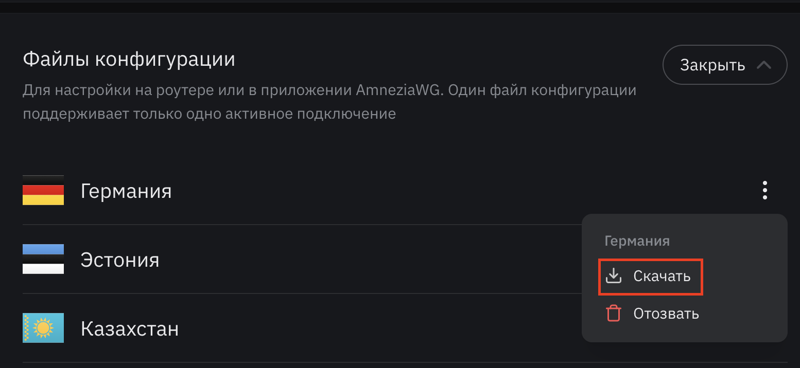

---

## 3) Установка конфигурации на роутер Keenetic/Netcraze

### 3.1 Включить компонент WireGuard

1. Откройте веб-интерфейс роутера: [`http://192.168.1.1`](http://192.168.1.1) (по умолчанию).
2. Войдите в админку (логин часто `Admin`, пароль — тот, что задавали при настройке).
3. Перейдите: **Управление → Настройка системы**.
4. Выберите **Изменить набор компонентов**.
5. Найдите компонент **WireGuard** и установите его.

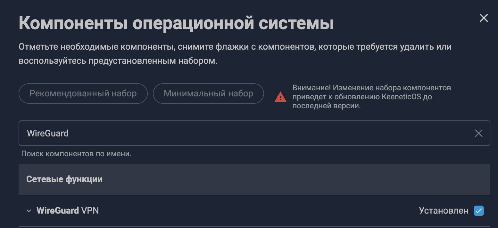

6. Дождитесь перезагрузки роутера.

### 3.2 Импортировать конфигурацию WireGuard

1. Перейдите: **Интернет → Другие подключения**.

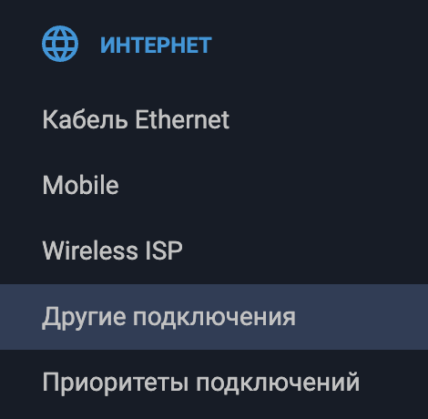

2. В блоке WireGuard выберите **Загрузить из файла**.

3. Укажите файл *.conf, скачанный из личного кабинета Amnezia.
4. Откройте созданное подключение и включите:
    - **Использовать для выхода в интернет** (галочка)
    
    
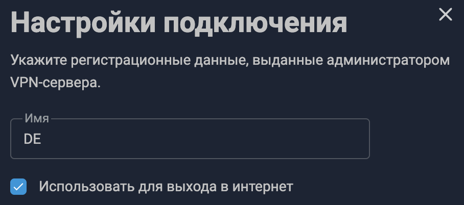

5. Сохраните настройки.
6. Включите подключение (ползунок **Вкл**).

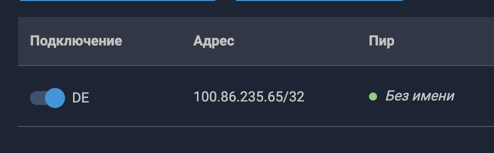

7. Если **Пир** горит зелёным — соединение установлено.

---

## 4) VPN на устройство/сеть (политики) — «всё устройство через VPN»

Это удобно, если нужно заворачивать через VPN:

- конкретное устройство (ПК/телефон/ТВ).
- или целую Wi‑Fi сеть/сегмент.

### Настройка политики

1. Перейдите: **Интернет → Приоритеты подключений**.

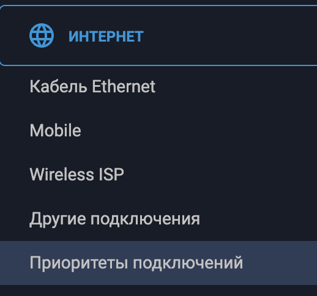

2. Нажмите **Добавить политику**.
3. Задайте имя (например, `Amnezia`) и сохраните.

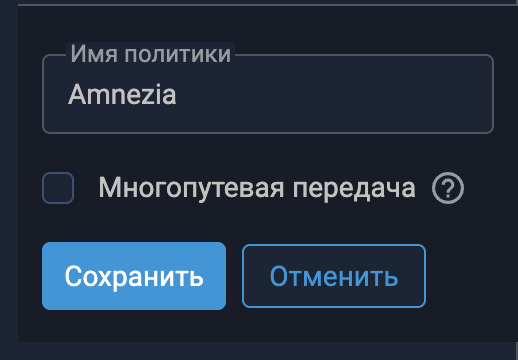

4. Отметьте галочку на вашем **WireGuard**‑подключении и нажмите **Сохранить**.

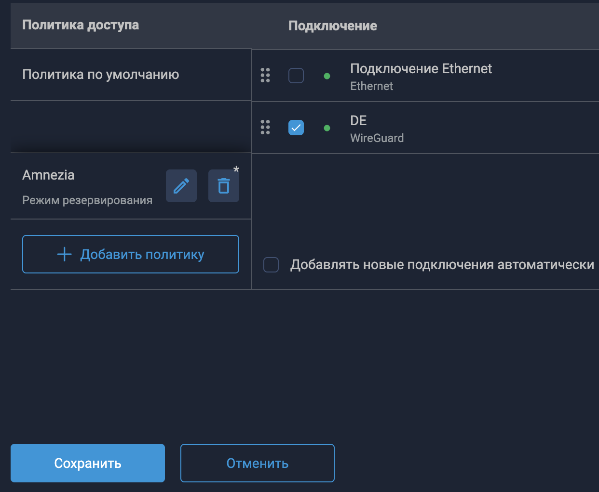

5. Перейдите во вкладку **Применение политик**.
6. Перетащите нужные устройства/сети в политику `Amnezia`. 

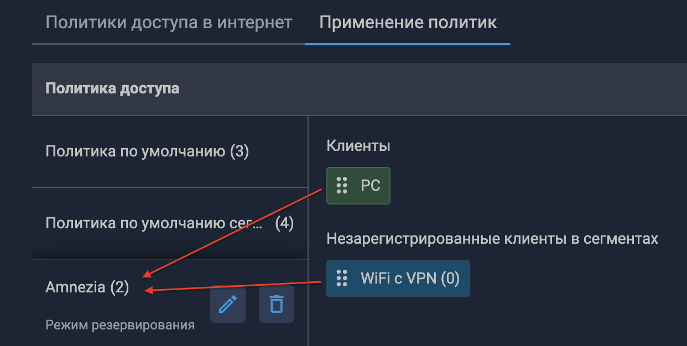

### (Опционально) Создать отдельную Wi‑Fi сеть под VPN

- Вкладка: **Мои сети и Wi‑Fi**
- Нажмите **+** и создайте новый сегмент/сеть, затем перетащите её в политику `Amnezia`.

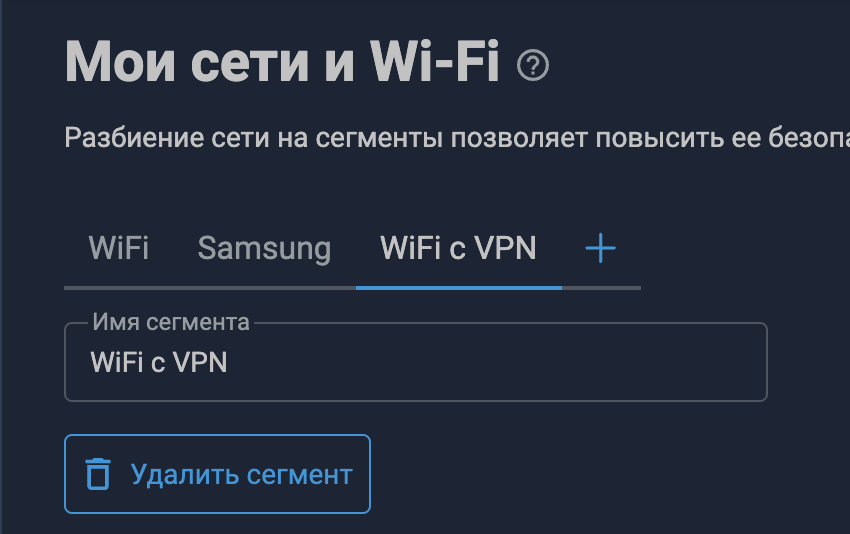

---

## 5) Раздельная маршрутизация (Split tunneling) — «часть сайтов через VPN»

В реальности часто бывает так, что **не весь трафик должен идти через VPN** (некоторые сайты/банки/сервисы могут работать хуже через VPN). Поэтому вариант ниже — более «практичный»: 

- по умолчанию — напрямую через провайдера.
- конкретные сервисы — через VPN (по маршрутам).

<aside>
📌

Перед настройкой маршрутов политику `Amnezia` лучше удалить, а устройство вернуть в политику **по умолчанию**.

</aside>

### 5.1 Куда заходить на роутере

1. Откройте: **Сетевые правила → Маршрутизация** (IPv4‑маршруты).

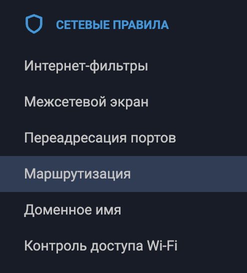

### 5.2 Сгенерировать маршруты для нужного сервиса (пример: YouTube)

1. Откройте сайт: [https://iplist.opencck.org/ru/](https://iplist.opencck.org/ru/) (альтернативный сайт с маршрутами [https://github.com/RockBlack-VPN/ip-address/tree/main/Global](https://github.com/RockBlack-VPN/ip-address/tree/main/Global) тут могут быть и другие сайты которые вам могут быть нужны)
2. Выберите формат: **Keenetic Routes (.bat)**
3. Тип данных: **IP‑зоны ipv4 (CIDR)**
4. Найдите сервис (например, **YouTube**) и отметьте галочкой.
5. Отметьте **Сохранить как файл** и скачайте `ip-list.bat`.

### 5.3 Загрузить *.bat на роутер

1. На странице маршрутизации нажмите **Загрузить**.
2. Обязательно выберите **интерфейс**: ваше WireGuard‑подключение (например, `DE`).
3. Загрузите скачанный `ip-list.bat`.
4. После импорта маршруты будут добавлены. При необходимости их можно удалить одной кнопкой.

---

## Завершение

Таким образом можно добавлять маршруты и для других сайтов/сервисов.

- Поддержать автора USDT TRC20: TEAF2HRcC7BtBUs1zmFM1b8Jj12Fxc1ecR
